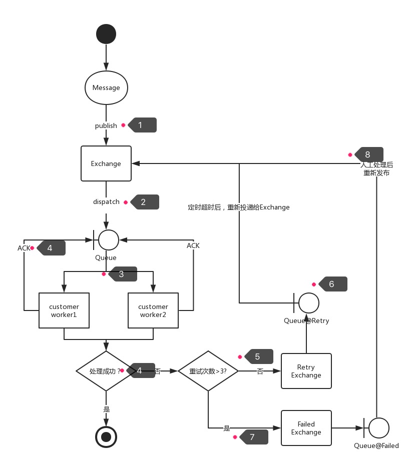

# RabbitMQ Example

参考:
- [spring-amqp-reference]
- [rabbitmq-document]
- [spring-boot-2.1.2 RabbitMQ support]

[spring-amqp-reference]: https://docs.spring.io/spring-amqp/reference/htmlsingle/
[rabbitmq-document]: http://www.rabbitmq.com/nack.html
[spring-boot-2.1.2 RabbitMQ support]: https://docs.spring.io/spring-boot/docs/2.1.2.RELEASE/reference/htmlsingle/#boot-features-rabbitmq
[RabbitMQ发布订阅实战-实现延时重试队列]: https://www.cnblogs.com/itrena/p/9044097.html

blog参考:
- [rabbit基础知识](https://blog.csdn.net/dreamchasering/article/details/77653512)
- [rabbit queue-arguments 含义](https://blog.csdn.net/qq_26656329/article/details/77891793)
- [exchange-type: topic、direct、fanout](https://blog.csdn.net/ww130929/article/details/72842234)
- [Spring 集成 RabbitMQ 与其概念，消息持久化，ACK机制](https://blog.csdn.net/u012129558/article/details/79530653)

## 安装
[windows下 安装 rabbitMQ 及操作常用命令](https://www.cnblogs.com/ericli-ericli/p/5902270.html)：rabbitMQ服务，及可视化管理控制台。
```
# 添加到window-service
cmd %local%/rabbitmq-service.bat install
```

### RabbitMQ support delay-message
rabbitMQ v3.5.8+开始不需要自己实现延迟消息队列。可以通过安装rabbit-plugin `rabbitmq_delayed_message_exchange`实现。
- [rabbitmq community plugins](https://www.rabbitmq.com/community-plugins.html)
- [rabbitmq-delayed-message-exchange](https://github.com/rabbitmq/rabbitmq-delayed-message-exchange)

扩展：
根据rabbit特性实现[RabbitMQ发布订阅实战-实现延时重试队列]。
> 本文将会讲解如何使用RabbitMQ实现延时重试和失败消息队列，
> 实现可靠的消息消费，消费失败后，自动延时将消息重新投递，
> 当达到一定的重试次数后，将消息投递到失败消息队列，等待人工介入处理。


## ack机制
ack机制可以解决：（客户端）消息丢失。
默认情况下，rabbitmq使用的是auto-ack，即服务端成功的将消息发送给消费者后，服务端就会移除该消息，而不关心此消息是否被成功消费。

- [RabbitMQ防止消息丢失](http://www.cnblogs.com/Leo_wl/p/6581989.html)
- [开发中使用RabbitMQ的手动确认机制](https://www.cnblogs.com/yucl/articles/7699761.html)

备注：
1. ack机制下，拒绝的消息会出现在"队首"，而不是"队尾"。可以通过消费此条消息，并重新publish一条相同的消息，来达到"队尾"的目的。
但是，无论如何要判断数据是否是最新的数据，否则可能出现old-data覆盖new-data。

2. ack机制引起的服务端内存泄漏、消费者重复消费、消息队列阻塞
ack模式下服务端只有在收到消费者确认后，才会从内存中删除消息，如果消费者忘了确认（或其它异常情况，导致服务端未接收到确认信息）。
那么，此消息一直处于服务端的消息队列的队首位置，所以会导致`消息队列阻塞`，并且会一直发送此消息给消费者消费（`消费者重复消费`），直到此条消息被移除。
因为消息队列阻塞，那么服务端会堆积越来越多的消息，导致`服务端内存泄漏`。

## 实际中遇到的问题
1. java.net.SocketException: socket closed
解决：https://blog.csdn.net/only09080229/article/details/43304543

个人也是创建了admin帐号（tags设置为administrator），删除guest。
启动时出现exception，然后查看admin帐号，发现没有"管理队列的权限"。

2. `header: x-dead`中的count一直未递增

在`main_queue`中成功ack，但数据处理错误时，会把此数据通过`channel.basicRecover()` publish给`retry_queue`; 
但是`header: x-dead`中的`count`未递增，改成ack/re-publish也不行。

主要是因为basicProperties是自己写代码从message.getMessageProperties()复制构造AMQP.BasicProperties。

更正`basicProperties = new DefaultMessagePropertiesConverter().fromMessageProperties(properties, "UTF-8")` 后count可以正常递增。

- [RabbitMQ发布订阅实战-实现延时重试队列]
- [Dead Letter Exchanges](http://next.rabbitmq.com/dlx.html)

3. spring-xml配置的问题
用xml的形式初始queue，可能会报: `received 'x-delayed-message' but current is 'direct'`。
但是，非springboot下相同的xml却没有这个问题（可能是我在demo中依赖了不同的rabbitmq-client导致的）。
解决:
　　在rabbitMQ安装plugins `rabbitmq-delayed-message-exchange`后问题解决。
　　但是exchange-type会从`direct -> x-delayed-message`（rabbitmq-management中查看）

## 备注
1. 4种手动ack：
`channel.basicAck(message.getMessageProperties().getDeliveryTag(), false)`: 只应答当前任务，任务会从队列中移除。
`channel.basicNack(deliveryTag, false, true)`: ack返回false，并重新回到队列。但是，会回到"队首"，会造成阻塞。
`channel.basicReject(deliveryTag, false)`: 拒绝处理消息。
`channel.basicRecover`: 消息重入队列，requeue=true，发送给新的consumer，false发送给相同的consumer。

一般的ack返回false或拒绝处理某条消息，都会是返回到消息队列的"队首"位置，而不是"队尾"。

2. rabbit实现延迟消息队列逻辑
blog: [RabbitMQ发布订阅实战-实现延时重试队列]
会有3个exchange、3个queue、3个routing-key。
但貌似通过direct，可以用1个exchange、3个queue、3个routing-key来实现。

设计思路 >>>>


## 参考

一般功能代码参考 >>>>
- [Spring集成RabbitMQ-连接和消息模板](https://www.jianshu.com/p/c65d15e718a2)：主要看 为AmqpTemplate/RabbitTemplate配置 RetryTemplate
- [消息队列 RabbitMQ 与 Spring 整合使用](https://www.cnblogs.com/libra0920/p/6230421.html)：spring-rabbit xml 配置代码参考
- [Spring整合RabbitMQ之注解实现](https://blog.csdn.net/liam1994/article/details/80707219)：注解模式，感觉xml形式创建queue、exchange、routing并不好管理"命名"

其它特性 >>>>
- [spring rabbitmq为listener配置并发消费者数量](https://blog.csdn.net/tszxlzc/article/details/51014101)
- [RabbitMQ之mandatory和immediate](https://blog.csdn.net/u013256816/article/details/54914525)

纯代码参考 >>>>
- [RabbitMq + Spring 实现ACK机制](https://my.oschina.net/gaoguofan/blog/776057)