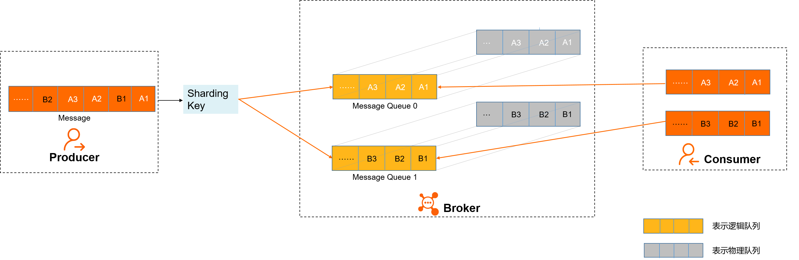

# 强制按订单逻辑顺序消费

## RocketMQ企业版，顺序消息

### 顺序消息1.0
顺序消息1.0：<https://help.aliyun.com/document_detail/201002.html>

> 分区顺序消息为例介绍在消息队列RocketMQ版中如何保证消息收发的顺序。  
> 
> **消息发送**  
> 如上图所示，A1、B1、A2、A3、B2、B3是订单A和订单B的消息产生的顺序，业务上要求同一订单的消息保持顺序，例如订单A的消息发送和消费都按照A1、A2、A3的顺序。  
> 如果是普通消息，订单A的消息可能会被轮询发送到不同的队列中，不同队列的消息将无法保持顺序，
> 而顺序消息发送时消息队列RocketMQ版支持将Sharding Key相同（例如同一订单号）的消息序路由到一个分区中。   
> 消息队列RocketMQ版服务端判定消息产生的顺序性是参照同一生产者发送消息的时序。
> 不同生产者、不同线程并发产生的消息，消息队列RocketMQ版服务端无法判定消息的先后顺序。
>
> **消息存储**  
> 如上图所示，顺序消息1.0中，Topic中的每个分区（逻辑分区）对应一个物理分区，  
> 当消息按照顺序发送到Topic中的逻辑分区时，每个分区的消息将按照同样的顺序存储到对应的物理分区中。
> 
> **消息消费**  
> 消息队列RocketMQ版按照存储的顺序将消息投递给Consumer，Consumer收到消息后也不对消息顺序做任何处理，按照接收到的顺序进行消费。  
> Consumer消费消息时，同一Sharding Key的消息使用单线程消费，保证消息消费顺序和存储顺序一致，最终实现消费顺序和发布顺序的一致。
> 
> 
> **顺序消息1.0中**，一个逻辑分区只能对应一个物理分区，且分区数一旦确定无法更改。
> 如果业务出现增长，单物理节点的性能会出现瓶颈，如果强行扩容会影响消息路由策略和顺序，拆分业务也会造成额外的改造成本。  
> 因此顺序消息1.0适用于业务比较稳定，消息量波动比较小，后期不需要进行扩容的场景。  
> 如果考虑业务增长可能需要扩容的情况，建议可以使用顺序消息2.0，支持水平无限扩容并对业务透明，避免了分区顺序的热点问题，且单个物理节点故障时支持秒级切换，业务侧无感知。
> 更多信息，请参见 [顺序消息2.0](https://help.aliyun.com/document_detail/49319.htm)。
> 
> 
> 注意事项  
> 使用顺序消息1.0时，请注意以下几点：  
> 1. 同一个Group ID只对应一种类型的Topic，即不同时用于顺序消息和无序消息的收发。  
> 什么意思？
> 2. 对于全局顺序消息，建议消息不要有阻塞。同时运行多个实例，是为了防止工作实例意外退出而导致业务中断。  
> 当工作实例退出时，其他实例可以立即接手工作，不会导致业务中断，实际工作的只会有一个实例。  
> 3. 消息队列RocketMQ版服务端判定消息产生的顺序性是参照单一生产者、单一线程并发下消息发送的时序。  
> 如果发送方有多个生产者或者有多个线程并发发送消息，则此时只能以到达消息队列RocketMQ版服务端的时序作为消息顺序的依据，和业务侧的发送顺序未必一致。

### 顺序消息2.0
顺序消息2.0：https://help.aliyun.com/document_detail/49319.htm

相比较于`顺序消息1.0`，最大的区别在于：“顺序消息2.0中，Topic中的每个逻辑分区可以对应多个物理分区”！  
**顺序消息2.0功能优势：**
- **无热点**  
  一个逻辑分区可以对应多个物理分区，消除了因为物理分区性能瓶颈导致的逻辑分区热点问题。即使是全局顺序消息，也不会出现单个逻辑分区的热点问题。  

- **高并发无限扩展**  
  在保持顺序的前提下，每个逻辑分区对应的物理分区可以无限水平扩展，极大提高消息处理的并发性，并且业务侧无感知，也不需额外的业务改造成本。  

- **故障秒级恢复**  
  单个物理分区故障，其他物理分区可继续处理消息，达到秒级切换，业务基本无感知。  

> 分区顺序消息为例介绍在消息队列RocketMQ版中如何保证消息的顺序。  
> 在消息队列RocketMQ版中，消息的顺序需要由以下三个阶段保证：  
> 
> **消息发送**  
> 如上图所示，A1、B1、A2、A3、B2、B3是订单A和订单B的消息产生的顺序，业务上要求同一订单的消息保持顺序，例如订单A的消息发送和消费都按照A1、A2、A3的顺序。  
> 如果是普通消息，订单A的消息可能会被轮询发送到不同的队列中，不同队列的消息将无法保持顺序，  
> 而顺序消息发送时消息队列RocketMQ版支持将Sharding Key相同（例如同一订单号）的消息序路由到一个分区中。
> 
> **消息存储**  
> 顺序消息2.0中，Topic中的每个逻辑分区可以对应多个物理分区，  
> 当消息按照顺序发送到Topic中的逻辑分区时，每个分区的消息将按照负载均匀的存储到对应的多个物理分区中，  
> 在物理分区中消息的存储可以不用保持顺序，但消息队列RocketMQ版中会记录消息在逻辑分区和物理分区中的映射关系及存储位置。
> 
> **消息消费**  
> 即使同一逻辑分区的消息被存储在不同的物理分区中且没有保持消息的顺序，但是基于顺序消息2.0的保序协议，
> 消息队列RocketMQ版服务端在投递消息时，最终还是会按照消息在逻辑队列中存储的顺序投递给Consumer，  
> Consumer消费消息时，同一Sharding Key的消息使用单线程消费，保证消息消费顺序和存储顺序一致，最终实现消费顺序和发布顺序的一致。  
> （<sapn style="color:red">consumer端如何实现的单线程消费？）

